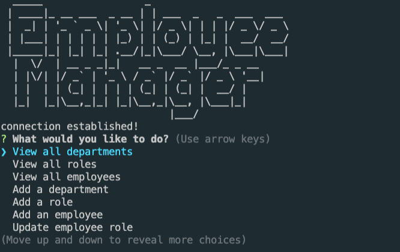

# Employee Management System

 

A command line application Content Management Systems for managing a company's employees where it can view and manage the departments, roles, and employees.

## Installation

1. Download or clone repository
2. Node.js is required to run the application
3. `npm install` to install the required npm packages

## Usage

* To start using the application, use mySQL Workbench to setup the database using this file

    [scheme.sql](employee-management-system/db/schema.sql)

* The application is invoked by running `node app.js` in the command line

* Follow the prompts to finish application
  

* [Video Demo](./assets/Untitled_%20Mar%2015%2C%202022%202_47%20AM.mp4)

* Website
  * [Github](https://github.com/ThiagoRodrigues3/employee-management-system)

## Features

* JavaScript
* Node.js
* MySQL
* npm packages
  * Inquirer
  * Figlet
  * mysql

## License
  
  Licensed under the [MIT](LICENSE) license.
